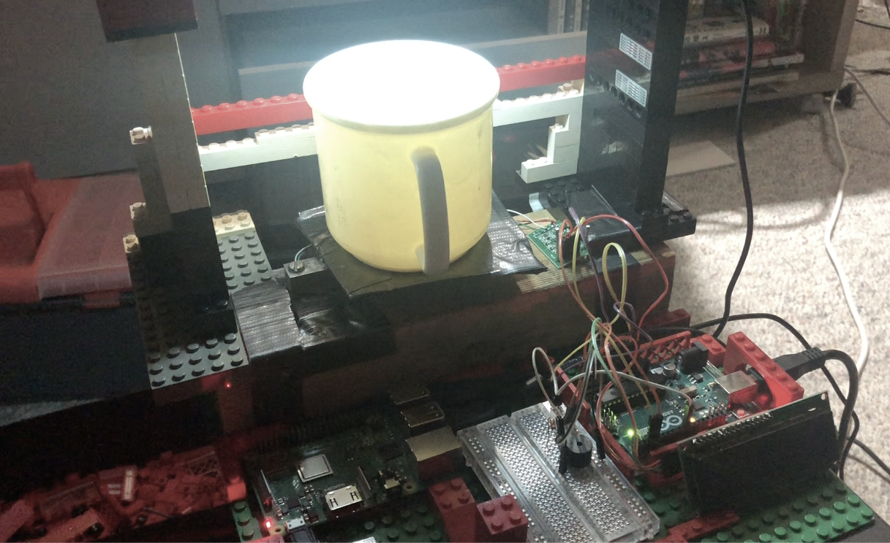
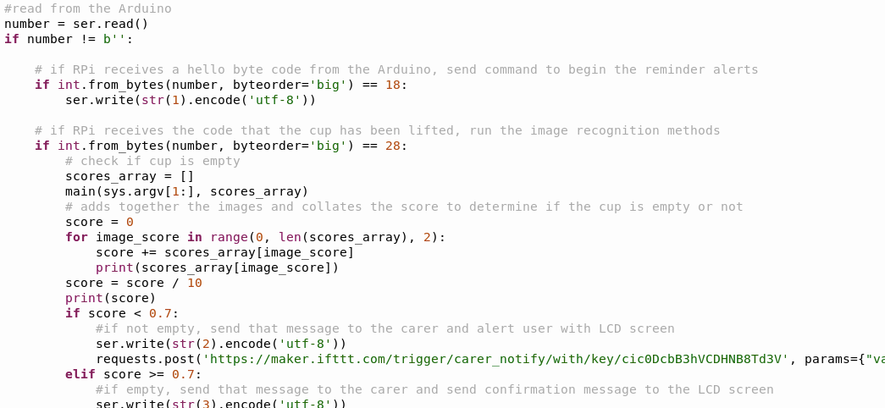

# ReMed
_a medication reminder system_

[Demo video](https://youtu.be/0rkuS3GUyuw)

[Explanation video of how to set up this project if you want to try it yourself](https://www.youtube.com/watch?v=op_oPEi2C4U)

## Overview

ReMed delivers notifications to a user when it is time to take their medication, based on a scheduled time. The system checks if all the medication has been taken from the cup. It sends notifications to the user via the LCD screen, and remote notifications to a carer through an app.

## Context
Older adults sometimes need the assistance of a carer, and ‘informal care’ refers to the unpaid work done (often by friends or family) to care for people with a disability. In Australia, this unpaid work amounts to a value of $19.3 billion, far exceeding the government contributions in this sector [^1]. Given the importance and cost of this work, it is necessary to develop technologies that can help carers with their work. One disease that has a significant impact on older people’s ability to live independently is dementia, which is one of the leading causes of disease burden in Australia [^2]. Even when an older person does not have this disease, they may also have a Mild Cognitive Impairment [^3]. Both of these conditions impact the memory and ability to complete daily tasks, such as taking medication. Given that some carers do not live with their care recipient, it is useful for medication dispensation technology to have remote capabilities and be easily used by someone unused to technology.

### Review of similar products

Given the importance of this technology, there are already multiple products available in Australia.

_Figures 1 [^4] & 2 [^5]: Typical automated pill dispensers available in Australia_

These products must be suitable for use by someone with cognitive deficits and potentially physical difficulties as well. One of the most easily available are products such as the Medelert [^6] or MedReady [^7] automated dispensers. These products will sound an alarm at the appropriate time and then dispense the appropriate medication. For people who must take medication at certain times or who have a lot of medications, it is a useful way to organise doses. Another benefit is that they are easy to receive medication from. Their carer can prepare the device in advance and lock it so the right pills are delivered at the right time. However, this device does not confirm the pills were taken and it is possible to forget some pills in a compartment. It also does not have any remote capabilities so the carer must confirm visually whether medication was taken or not. Similarly, the MedTime Plus will confirm that the dispenser was tipped over but not that the compartment was emptied [^8]. There is a more expensive version of the MedReady [^9] which sends alerts via SMS for missed doses. However, this device does not confirm the compartment is emptied, and the cost is quite high ($499 with an ongoing $19.95 p/mth subscription fee).

### Product Requirements 

To summarise there is a gap in the market for:  

* an affordable product with no or low monthly costs.

* remote confirmation for a carer of whether all medication was taken.

Other important features are:

* Customisability for dosage schedules, with labelling to aid organisation.

* Secure access so that only the correct pills can be accessed at each time.

* Easy dispenser, suitable for people with mobility difficulties.

This prototype will focus on delivering remote confirmation capabilities.

### Use Cases
| Carer | Person taking the medication|
|-----|-----|
|Removes tablet organiser|Sees the LCD screen reminder to take their medication|
|Loads tablets into the organiser|Hears a buzzing sound when for 30 minutes following the reminder time|
|Replaces organiser|Receives medication from the cup|
|Sets the time of day for the reminder|Sees the confirmation on the LCD screen, or a reminder to check again for forgotten tablets|
|Receives daily reports confirming whether the medication was all taken from the cup||

## Prototype Architecture 

*Figure 3: UML diagram of the system architecture*

## Solution in context

1. The software for the system begins from the Raspberry Pi (RPi), which runs a [Python file](./reMedRPiController.py) with a scheduling method that waits until the reminder time.

2. At the reminder time, the RPi opens a USB serial connection with the Arduino [^10]. If it receives an acknowledgement byte back, it tells the Arduino to begin the reminder program. Code [here](./reMedArduinoController.cpp).

3. The Arduino begins firing the buzzer[^11] (connected via breadboard) every 10 seconds and displays a reminder medication to the LCD screen (connected via I2C). The LCD screen contrast was calibrated to be easily visible [^12].

4. The Arduino is connected to a weight sensor, consisting of a 0-5kg load cell and a HX711 conversion module calibrated using a tare program [^13]. The weight sensor is monitoring a platform, on top of which is the cup for receiving the medication. When the weight changes indicating the cup is lifted, the Arduino waits again until the cup is placed back down and then informs the RPi.

_Figure 4: A light illuminates the cup for the camera_

5. A light is attached above the cup to illuminate the contents of the cup. There is also a webcam mounted to see the cup’s contents. Through USB, the RPi uses the webcam to run an image recognition system [^14] and classifies 10 images it takes using the webcam [^15].

_Figure 5: Screenshot of the classification testing_

_Figure 6: Screenshot of the result of the initial model training_

6. If the RPi receives a result of more than 0.7 certainty it is seeing a cup, it decides the cup is empty. The RPi tells the Arduino to display a confirmation message to the LCD screen for 10 seconds before turning off the backlight. It sends a notification to the carer via IFTTT [^16] informing them the medication was taken. The screenshot in Figure 7 shows examples of the notification being received by the carer.

_Figure 7: Notifications to the carer_

7. If the Arduino doesn’t detect the cup being lifted for 30 minutes, it stops the reminder procedure and tells the RPi. The RPi then sends a notification to the carer telling them the medication was forgotten.

8. If the RPi decides there is a pill in the cup, it tells the Arduino to display a message to the LCD informing them to check the cup again. It notifies the carer that not all medication was taken.

## Refining the system - testing and reflection
This section is explained in video format in the explanation video linked at the top of this page

#### Weight sensor
The load cell was calibrated using a tare program which printed out information to the console. I used this information to check the accuracy of the sensor, by comparing it with measurements taken by my kitchen scales. It needed to be responsive enough to detect when the cup was picked up, and it detected the changes in weight within 1 second.

_Figure 7: Output from the load cell during calibration, used to test responsiveness_

#### Light

At first I wanted the light to be powered by the RPi so it could turn on as part of the notification system. However, the light from a LED was not bright enough to illuminate the cup for the image recognition software. During the first round of setting up the machine learning model, the LED light was changed to a battery powered light. It would be good if the light was on whenever the system is connected to power to indicate the ReMed is working. The light could brighten during the checking process and dull again during the down time to save power.

#### Image recognition

Using the camera feed to the Edge Impulse website to determine the best height for the cup to fill the frame. I adjusted the LEGO frame I was using to get the best height. This way all of the cup is visible, but the camera is close so the picture is still accurate. I tested my image recognition model using small white pills in a  white cup, which would be one of the hardest pills to detect. It was still reliably able to detect these small pills during my tests. However, I was limited by the cup colours and pills available in my house.I would need to experiment with a range of pills and cups to find the best plastic colour. It may also be that case that users would replace the ReMed cup with their own preferred cup, so the model would need to be trained to recognise pills in many colours.

#### The LCD screen and the buzzer.

The LCD screen is able to update its text very quickly, so it was was more than responsive enough to provide timely information to the user. The buzzer needed to be audible to older people, as older people often have hearing loss at the upper and lower spectrums of the human hearing range, so I decided to make the buzzer move back and forth from a high to a low tone.

#### Controller software

Although the function of this system are very simple, it still requires a coordinating device for all the components. The “brains” of this system is the RPi. At first I considered putting the entire system on I2C with the RPi as the master. However, after researching the various libraries, I found the simplest strategy was to use USB serial between the RPi and the Arduino. All the communication is done with codes converted to bytes, so with a very short message they can instruct each other in what to do. This makes the system responsiveness very easy to control. I did add some delay code to both in order to wait for the user to complete their action before running the next program. For example, the user might have impaired mobility and have trouble setting the cup on the platform smoothly. There are also delays to ensure equipment has time to settle and can give accurate readings, such as the load cell and HX711. Finally, the loops all contain timeouts to avoid infinite loops.

After I had successfully integrated all the components and got the Python SDK image recognition running on the RPi, I redid my model with more images. I took around 50 images to use for my training data, and around 15 for testing data. Below you can see the output I used to validate the model. Using the average of 10 images, the RPi could correctly classify the cup even when the forgotten pill was only very small.

---

[^1]: https://www.aihw.gov.au/reports/aged-care/carers-australia-assisting-older-people-disability/contents/table-of-contents

[^2]: https://www.aihw.gov.au/reports-data/health-conditions-disability-deaths/dementia/overview 

[^3]: https://www.dementia.org.au/about-dementia-and-memory-loss/about-dementia/memory-loss/mild-cognitive-impairment

[^4]: https://www.tabtimer.com.au/epages/tata4926.sf/en_AU/?ObjectPath=/Shops/tata4926/Products/TT-TIPPER 

[^5]: https://www.tabtimer.com.au/epages/tata4926.sf/en_AU/?ObjectPath=/Shops/tata4926/Products/TT6-28SC 

[^6]: https://superpharmacyplus.com.au/tabtimer-pill-disp-2-lid-whit/ 

[^7]: https://www.tabtimer.com.au/epages/tata4926.sf/en_AU/?ObjectPath=/Shops/tata4926/Products/MR-1700PRN/

[^8]: https://www.epill.com/medtimeplus.html/ 

[^9]:  https://superpharmacyplus.com.au/medready-mr-357fl-auto-pill-dispenser-sms-email-alerts-light/ 

[^10]:  Using the guide to SerialResponse library from https://magpi.raspberrypi.org/articles/program-arduino-uno-raspberry-pi  and https://roboticsbackend.com/raspberry-pi-arduino-serial-communication/

[^11]: Using code from https://www.ardumotive.com/how-to-use-a-buzzer-en.html

[^12]: Following a guide at https://www.makerguides.com/character-i2c-lcd-arduino-tutorial/

[^13]: Code from https://makersportal.com/blog/2019/5/12/arduino-weighing-scale-with-load-cell-and-hx711

[^14]: The image recognition machine learning model was built using Edge Impulse, following the instructions at https://www.raspberrypi.org/blog/edge-impulse-and-tinyml-on-raspberry-pi/ 

[^15]: Instructions for setting up Python SDK from https://docs.edgeimpulse.com/docs/linux-python-sdk

[^16]: Following a guide at https://thepihut.com/blogs/raspberry-pi-tutorials/using-ifttt-with-the-raspberry-pi
